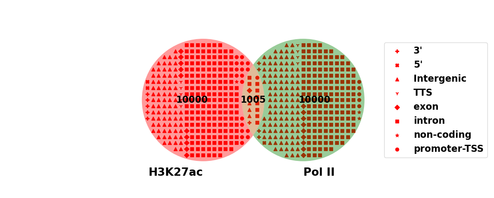

# vennpi
add on to matplotlib-venn

need pybedtools to run the example

awk commands to process homer annotatePeaks.pl into bedtools compatabile 

note they have been downsampled for to provide toy data 

awk 'FNR > 1 {print $2"\t"$3"\t"$4"\t"$8"\t"$6"\t"$5}' peaksA.bed.anno > peaksA.bed

awk 'FNR > 1 {print $2"\t"$3"\t"$4"\t"$8"\t"$6"\t"$5}' peaksB.bed.anno > peaksB.bed

